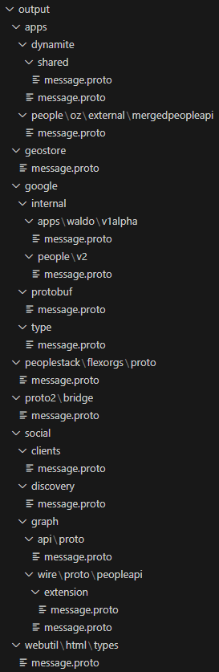

### req2proto v0.1

This project seeks to reverse-engineer Google internal protobuf definitions through error messages returned when sent protojson payloads.

> This is still in an experimental state

```
$ go build; ./req2proto -H "Authorization: Bearer ya29...." -X POST -u https://people-pa.googleapis.com/v2/people -p google.internal.people.v2.InsertPersonRequest -o output
```

The `output` dir will then contain the request `.proto` files.


**TODO List**
- [ ] Add protojson response parsing support (in case the endpoint supports only protojson)
- [ ] Add automatic .proto import
- [ ] Support multithreading

**Example output:**

